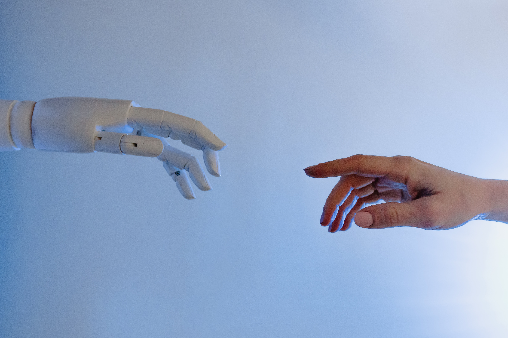

#  🦾 DATARAVE Live Coding Collaborative Robot 

**A Tool for audiovisual live coding environments for collaborative performances.**

## 📋 Table of Contents
- ℹ️ [DATARAVE?](#about)
- 🕹️ [What can I do with DATARAVE?](#features-overview)
- 👁️‍ [Who is it for?](#-vision--goals)
- 🎬 [Let's get started!](#install)
- 🤍 [Thanks](#-thanks)

## About 

**DATARAVE is a tool for audiovisual live coding environments for collaborative performances.**

Hello welcome to my github

## Install

Please read the [user manual](https://github.com/DirkvdBruggen/Datarave/blob/main/User%20Manual.md) for installing the software needed to try Algorave!